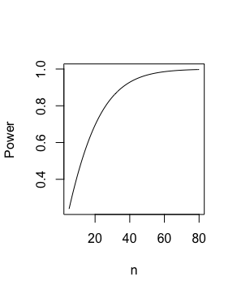
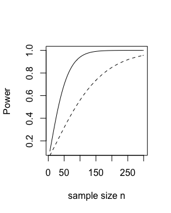
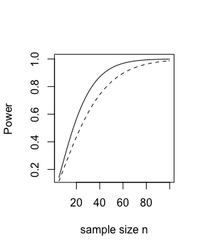

# Statistical Power Analysis for the Social & Behavioral Sciences Notes

### Z-test

To explore how power, alpha, effect size, and number of subjects are related, change the parameters in the code below.

**Non-centrality parameter:** the mean of the sample normal distribution given the alternative hypothesis is true (i.e., that the sample mean is significantly different than the population mean).

```
n=62 # number of subjects
a=.05# a stands for alpha
d=.5 # d=Delta/sigma (effect size)
nc=d*sqrt(n/2) # nc stands for non-centrality parameter 
# power in a one-sided test: 
1-pnorm(qnorm(1-a)-nc) 
# power in a two-sided test:
pnorm(nc-qnorm(1-a/2))+pnorm(qnorm(a/2)-nc)
```

**Standardized effect size**: percentage of overlap between two contrasted normal populations.

* Small effect size (.2) -- populations share 69% of their values.
* Medium effect size (.5) -- populations share 80% of their values.
* Large effect size (.8) -- populations share 92% of their values.

**Common language effect size**: how likely is it that a randomly selected observation from one population is larger than a randomly selected observation from another sample? (probability of superiority; this can tell us how different the populations are).

* Small effect size (.2) -- probability of superiority = .56.
* Medium effect size (.5) -- probability of superiority = .64.
* Large effect size (.8) -- probability of superiority = .71.

Standardized effect size and common language effect size are mathematically identical.

### T-test
#### One-sample t-test

Comparing two means. In the example below, we're trying to see if a sample mean of 2750 is different than the population mean of 3000, given a standard deviation of 500.

```
#power for one-sample t 
n=25:30 #n=25,26,27,28,29,30
v=n-1
a=.05
d=(2750-3000)/500 #sigma=500 
nc=d*sqrt(n) pt(qt(a,v),v,nc) 
#curve plots power vs n
curve(pt(qt(.05,x-1),x-1,-.5*sqrt(x)) ,5,80,ylab="Power",xlab="n")
```



You can see in this plot that power should be sufficient by 40-ish subjects.

#### Two-sample t-test

Comparing two groups. Here, with two groups of 65 subjects, we have enough power to detect a medium-size effect.

```
#power for two-sample t
n1=65 
n2=65
v=n1+n2-2 
a=.05
# a stands for alpha
d=.5
# d=Delta/sigma
# nc stands for non-centrality parameter 
nc=d*sqrt(n1*n2/(n1+n2))
1-pt(qt(1-a/2,v),v,nc)+pt(qt(a/2,v),v,nc) #power.
```



In this plot, the dotted line compares power and sample size when the effect size is .5, while the dashed line refers to an effect size of .3. You can see that the number of subjects needed to get 0.8 power changes based on effect size.

#### Paired t-test

Comparing two measurements within subjects or for paired subjects. For this power analysis, we need an additional parameter, the correlation between the two samples. We use this correlation value to adjust the non-centrality parameter, usually upward. This is why within-subjects designs usually need fewer subjects than between-subjects designs.

```
#paired t-test
n=34 
a=.05 # alpha 
r=.5 #correlation 
d=.5 # d=Delta/sigma 
nc=sqrt(n/2)*d/sqrt(1-r)
1-pt(qt(1-a/2,n-1),n-1,nc)+pt(qt(a/2,n-1),n-1,nc)
```



This plot is similar to the one above, where the solid line represents an effect size of .5 while the dashed line represents a .3 effect size. You can see that the lines are a lot closer, and power is a lot higher for the .3 case than it was for the two-sample test.

### Uncertainty in power analysis

We are often trying to figure out how many subjects we need to run for a study. Lenth (2001) advises against using the rule-of-thumb numbers because they are not contextualized, and don't differentiate between a large unstandardized effect or small variance within populations. You can computer a confidence interval to avoid this issue.